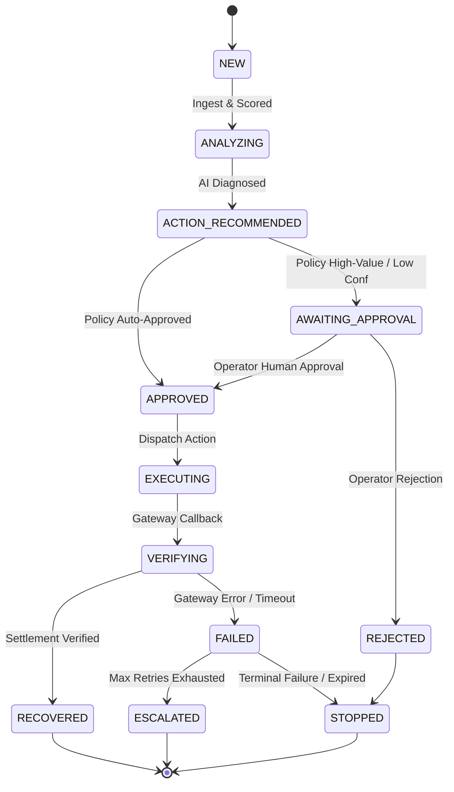

# ⚡ Revive AI — Autonomous Revenue Recovery & Payment Failure Resolution Platform
### *A Production-Oriented Fintech Engineering Prototype for Payment Recovery & Failure Resolution*

[](https://reviveay-ai.vercel.app/demo)
[](https://revivepay-backend.onrender.com/docs)
[](https://revivepay-backend.onrender.com)

[](https://github.com/harshchavan009/Revivepay-ai/actions)
[](https://www.python.org/downloads/)
[](https://react.dev/)
[](https://fastapi.tiangolo.com/)
[](https://www.postgresql.org/)
[](tests/)
[-indigo.svg)](ml/MODEL_CARD.md)
[](#-operational-scope--disclaimers)
[](backend/services/audit_service.py)

---

### 🌐 Live Production Deployments & Quick Links

| Service | Live Deployment URL | Description |
| :--- | :--- | :--- |
| **🚀 Recruiter Demo Journey** | **[https://reviveay-ai.vercel.app/demo](https://reviveay-ai.vercel.app/demo)** | **Interactive 5-minute guided demonstration** showing real end-to-end failure $\to$ diagnosis $\to$ policy $\to$ recovery $\to$ audit. |
| **🖥️ Executive Command Center** | **[https://reviveay-ai.vercel.app/](https://reviveay-ai.vercel.app/)** | Live React 19 dashboard streaming real PostgreSQL metrics via Server-Sent Events (SSE). |
| **⚡ FastAPI Backend API** | **[https://revivepay-backend.onrender.com](https://revivepay-backend.onrender.com)** | High-performance Python backend deployed on Render Docker containers with auto-migrations. |
| **📖 Interactive API Docs** | **[https://revivepay-backend.onrender.com/docs](https://revivepay-backend.onrender.com/docs)** | OpenAPI Swagger documentation for all 35+ REST endpoints. |
| **🐘 Managed PostgreSQL** | `Render Dedicated PostgreSQL` | Fully migrated schema with Alembic and seeded canonical synthetic cases. |

> **Scope & Positioning Disclosure**:  
> Revive AI is an open-source **production-oriented fintech engineering prototype** designed to demonstrate policy-governed autonomous revenue recovery across transient payment failures, recurring subscription dunning declines, and abandoned checkout sessions in a **sandbox / demonstration environment**.  
> All live gateway interactions operate strictly in **Razorpay Test Mode**, with machine learning models benchmarked via **synthetic ML evaluation**. The platform is not certified by or affiliated with the Reserve Bank of India (RBI).

---

## 📖 Project Overview

In traditional payment setups, failed transactions are often handled with naive automated retries or blanket customer emails. This frequently leads to duplicate charges, customer frustration, gateway rate-limiting, and unnecessary churn.

**Revive AI** demonstrates a bounded decision-and-recovery architecture that evaluates failure codes, customer payment reliability, transaction size, and merchant safety rules before recommending or executing any action:

$$\textbf{INGEST} \longrightarrow \textbf{RISK SCORE} \longrightarrow \textbf{ML LIKELIHOOD} \longrightarrow \textbf{AI DIAGNOSIS} \longrightarrow \textbf{POLICY GATE} \longrightarrow \textbf{EXECUTE} \longrightarrow \textbf{VERIFY} \longrightarrow \textbf{AUDIT}$$

### 🎯 Core Engineering Objectives
- **Single Source of Truth**: All metrics (Recovered Revenue, Recovery Rate, Failed Payments, Active Recovery) are computed dynamically from backend database state—never hardcoded or invented by the UI.
- **Strict Division of Labor**: Generative AI is strictly confined to root-cause diagnosis, reasoning, recommendation, operator explanation, and customer messaging. Financial boundaries, retry limits, amount thresholds, consent, state transitions, audit logging, and settlement verifications are strictly deterministic.
- **Real Webhook Idempotency**: Enforces `UNIQUE(provider, provider_event_id)`. Replaying identical webhooks returns `duplicate_ignored` with HTTP 200 without creating secondary recovery cases, duplicate customer alerts, or double-counted revenue.
- **Honest Ingress Separation**: Transparently separates real **Razorpay Test Mode** webhook ingestion (with HMAC-SHA256 signature verification) from the synthetic **Simulation** harness, routing both into the shared recovery pipeline.
- **Cryptographic Auditability**: Every decision, policy evaluation, and state transition is immutably recorded in a SHA-256 hash-chained ledger.
- **Deterministic Outcome Verification**: A case cannot be marked `RECOVERED` by an AI model; state progression to `RECOVERED` strictly requires direct payment capture verification from gateway callbacks.

---

## 🎬 5-Minute Recruiter Demonstration Journey

Experience the live end-to-end recovery pipeline in under 5 minutes without manual configuration:

👉 **Launch the Interactive Recruiter Demo**: **[https://reviveay-ai.vercel.app/demo](https://reviveay-ai.vercel.app/demo)**

```
Recruiter Clicks "Start Demo"
           ↓
[1] Gateway Failure Ingestion ──> Razorpay Webhook with error code GATEWAY_TIMEOUT_504
           ↓
[2] Risk Scoring Engine       ──> Evaluates 4-factor formula (Value, Likelihood, History, Severity)
           ↓
[3] ML Likelihood Classifier  ──> Gradient Boosting Calibrated Classifier scores 74% recoverability
           ↓
[4] Multi-Tier AI Diagnosis   ──> Claude 3.5 Sonnet / Gemini 1.5 Pro analyzes root cause (96% confidence)
           ↓
[5] Deterministic Policy Gate ──> Evaluates 7 hardcoded rules (₹10k limit, max 2 retries, DPDP consent)
           ↓
[6] Bounded Execution         ──> Safe gateway retry or 1-Click WhatsApp recovery link dispatched
           ↓
[7] Bank Verification         ──> Direct gateway capture verification confirms settlement
           ↓
[8] Cryptographic Ledger      ──> SHA-256 block chained to immutable audit log + KPIs updated live
```

### Pre-Configured Interactive Scenarios:
1. **Temporary Bank Failure (₹4,999)**: The flagship killer demo showcasing automated retry, deterministic policy clearance, and immediate bank verification.
2. **Insufficient Funds (₹2,499)**: AI diagnoses customer liquidity window and recommends a non-intrusive 1-Click WhatsApp payment link to avoid bounce penalties.
3. **High-Value Transaction (₹85,000)**: Deterministic policy intercepts high transaction value exceeding ₹50,000 auto limit, requiring human operator sign-off in the **Approval Center**.
4. **Retry Exhaustion (₹6,200)**: Simulates 2 failed retries triggering an automated deterministic policy block and case escalation to avoid spamming the customer.

---

## 🏛️ Architectural Division of Labor

Revive AI establishes an uncompromised boundary separating probabilistic AI reasoning from deterministic safety code:

```
┌────────────────────────────────────────────────────────────────────────┐
│                        REVIVEPAY AI ARCHITECTURE                       │
└────────────────────────────────────────────────────────────────────────┘
                                    │
          ┌─────────────────────────┴─────────────────────────┐
          ▼                                                   ▼
┌───────────────────────────────────┐       ┌───────────────────────────────────┐
│             AI SPHERE             │       │     DETERMINISTIC CODE SPHERE     │
├───────────────────────────────────┤       ├───────────────────────────────────┤
│ 1. Root-Cause Diagnosis           │       │ 1. Risk Score (pure math formula) │
│ 2. Contextual Reasoning           │       │ 2. Retry Limits (hard max 2 cap)  │
│ 3. Recovery Recommendation        │       │ 3. Amount Limits (₹10k/₹50k gates)│
│ 4. Operator Explanation           │       │ 4. DPDP Customer Consent Checks   │
│ 5. Customer-Message Generation    │       │ 5. RBAC & Step-Up Permissions     │
│                                   │       │ 6. Allowed Actions Whitelisting   │
│ (Claude 3.5 Sonnet / Gemini 1.5   │       │ 7. Policy Gateway Safety Rules    │
│ Pro / Deterministic Rules Floor)  │       │ 8. Finite State Machine (FSM)     │
│                                   │       │ 9. SHA-256 Hash-Chained Audit     │
│                                   │       │ 10. Direct Bank Outcome Verify    │
└───────────────────────────────────┘       └───────────────────────────────────┘
```

---

## 🚀 Key Technical Modules

### 1. 🧠 Multi-Tier AI Root-Cause Reasoner
Interprets gateway error codes, card rails, timing telemetry, and customer history into structured recovery recommendations:
- **Pydantic Validation**: Strict schema enforcement guarantees $100\%$ type conformance on every LLM output.
- **3-Tier Fallback Hierarchy**:
  - **Tier 1 (Primary)**: Anthropic Claude 3.5 Sonnet for detailed operational reasoning.
  - **Tier 2 (Secondary)**: Google Gemini 1.5 Pro for rapid automatic failover.
  - **Tier 3 (Safe Floor)**: Local Deterministic Rules Engine ensuring continuous operation with zero external dependencies.
- **Strict Tool Whitelist**:
  `retry_payment`, `create_payment_link`, `send_customer_notification`, `trigger_checkout_reminder`, `request_payment_method_update`, `escalate_to_merchant`, `stop_recovery`.

### 2. 📊 Deterministic Revenue Risk Scoring Engine
Before invoking AI diagnosis, each failure is scored by a deterministic mathematical formula ($0 \text{ to } 100$):

$$\text{Risk Score} = 0.35 \times \text{Value Factor} + 0.25 \times \text{Recovery Likelihood} + 0.20 \times \text{Customer History} + 0.20 \times \text{Failure Severity}$$

| Score Range | Risk Level | Action Routing |
| :--- | :--- | :--- |
| **0 – 29** | `LOW` | Eligible for automated recovery action |
| **30 – 59** | `MEDIUM` | Standard policy-guided evaluation |
| **60 – 79** | `HIGH` | Operator review recommended |
| **80 – 100** | `CRITICAL` | Mandatory human authorization required |

### 3. 🤖 Machine Learning Model: Empirical Specification ([ml/MODEL_CARD.md](ml/MODEL_CARD.md))

> **Methodology Disclosure**:  
> **Baseline recovery-likelihood model evaluated on a synthetic held-out dataset.**  
> Metrics reported below reflect an 80/20 train/test split on simulated payment failure telemetry modeled after Indian payment rail dynamics (Razorpay, UPI, cards, and netbanking), not unverified production claims.

| Dimension | Specification |
| :--- | :--- |
| **Dataset** | 5,000 synthetic failure events simulating Indian payment rail mechanics (switch timeouts, UPI VPA latency, balance dips, expired cards). |
| **Training Size** | **4,000 samples** (80% stratified train split) |
| **Test Size** | **1,000 samples** (20% held-out test split, stratified by outcome) |
| **Features (10 Signals)** | `transaction_amount`, `failure_category_encoded`, `payment_method_encoded`, `customer_success_rate`, `customer_failure_rate`, `retry_count`, `customer_tenure_days`, `is_subscription`, `previous_recovery_success`, `checkout_intent_score` |
| **Model** | `CalibratedClassifierCV(estimator=GradientBoostingClassifier(n_estimators=120, learning_rate=0.08, max_depth=4, subsample=0.85), method='isotonic', cv=5)` |
| **ROC-AUC** | **0.8094** (80.94% on synthetic held-out test split) |
| **Precision** | **0.8146** (81.46% on synthetic held-out test split) |
| **Recall** | **0.9341** (93.41% on synthetic held-out test split) |
| **F1 Score** | **0.8702** (87.02% harmonic mean on held-out test split) |
| **Calibration** | **Brier Score: 0.1401** (Isotonic Regression calibrated; predicted probabilities align with observed empirical frequencies across 10 reliability bins). |

### 4. 🛡️ Deterministic Policy & Safety Gateway
Every action proposed by AI must pass 11 deterministic safety invariants before execution:
- `IF retry_count >= max_retries` $\rightarrow$ **BLOCK & ESCALATE** (Hard max 2 retries)
- `IF payment_status == SUCCESS` $\rightarrow$ **BLOCK** (Settled payments are immutable)
- `IF failure_type == PERMANENT` (e.g., stolen card, void token) $\rightarrow$ **BLOCK RETRY**
- `IF customer_opted_out == TRUE` $\rightarrow$ **BLOCK NOTIFICATIONS** (DPDP compliance)
- `IF amount >= ₹50,000` $\rightarrow$ **REQUIRE STEP-UP HUMAN AUTHORIZATION**
- `IF ai_confidence < 0.70` $\rightarrow$ **REQUIRE HUMAN REVIEW**

### 5. 🔎 Cryptographic SHA-256 Hash-Chained Audit Ledger
Every state transition and policy check is cryptographically linked to its predecessor:

$$\text{entry\_hash} = \text{SHA-256}(\text{previous\_hash} + \text{timestamp} + \text{case\_id} + \text{action} + \text{actor})$$

- **Tamper Evident**: Modifying any past database record breaks all subsequent chain hashes.
- **Verification Endpoint**: `GET /api/audit/verify-chain` programmatically validates the ledger from genesis to head.

### 6. 🔬 Dedicated Outcome Verification Service
- Isolates payment capture verification before committing the `RECOVERED` state.
- Matches provider payment ID, capture state, currency, and amount.
- **Recovered revenue metrics only update after verified settlement**.

### 7. ⚖️ Educational Reference Implementations (Published RBI Frameworks)
- **Turn Around Time (TAT) Reference Implementation (RBI/2019-20/67)**: Demonstrates auto-reversal deadline calculations (UPI $T+1$, Card $T+5$ working days) and tracks statutory ₹100/day compensation indicators on overdue cases.
- **e-Mandate Pre-Debit Alert Implementation**: Educational reference implementation of the 24-hour pre-debit customer notification window.

---

## 🚦 Recovery State Machine

The backend recovery lifecycle follows 12 explicit, non-overlapping states:



---

## 💻 Technology Stack

| Layer | Technologies |
| :--- | :--- |
| **Frontend UI** | React 19, TypeScript, Vite, Tailwind CSS, Lucide Icons, Recharts |
| **Backend API** | FastAPI 0.115, Python 3.11+, Pydantic v2, Uvicorn (ASGI) |
| **Database & ORM** | PostgreSQL 16 / SQLite (Local Dev), SQLAlchemy 2.0, Alembic |
| **Machine Learning** | Scikit-learn (Calibrated Gradient Boosting), NumPy, Pandas, Joblib |
| **AI Reasoning** | Multi-Tier Orchestrator: Claude 3.5 Sonnet $\rightarrow$ Gemini 1.5 Pro $\rightarrow$ Deterministic Rules Floor |
| **Gateway Integration** | Razorpay Test Mode API, Timing-Safe HMAC-SHA256 Webhooks, Idempotency Deduplication |
| **Observability & Audit**| SHA-256 Hash-Chained Audit Ledger, Server-Sent Events (SSE) Live Feed, Structured Logging |
| **Containerization** | Docker, Docker Compose, Nginx (Frontend Reverse Proxy) |
| **CI / CD** | GitHub Actions (Lint, Typecheck, ML Calibration, Secrets Scanner, 88 Pytest Suite) |

---

## 📁 Repository Directory Structure

```text
.
├── backend/
│   ├── api/                     # FastAPI route handlers (recovery, webhooks, ml, auth)
│   ├── events/                  # Canonical event taxonomy & validator
│   ├── models/                  # 11 SQLAlchemy domain entities
│   ├── schemas/                 # Pydantic v2 response & request schemas
│   ├── services/                # Domain services (ai_agent, policy_gateway, recovery_engine)
│   │   ├── razorpay_service.py  # HMAC-SHA256 verification & test API client
│   │   ├── recovery_engine.py   # Recovery orchestration & idempotency guards
│   │   ├── risk_engine.py       # 4-factor deterministic risk formula
│   │   ├── ai_agent.py          # Multi-tier LLM reasoner & safe fallback
│   │   ├── policy_gateway.py    # Deterministic safety rules gateway
│   │   ├── outcome_verification_service.py # Settlement verification
│   │   └── audit_service.py     # SHA-256 cryptographic hash-chain builder
│   ├── tests/                   # 88 Pytest backend integration & invariant tests
│   ├── database.py              # SQLAlchemy connection pooling & SessionLocal
│   ├── config.py                # Pydantic settings & environment configuration
│   └── main.py                  # FastAPI application entrypoint & middleware
├── ml/
│   ├── train.py                 # Calibrated model training script
│   ├── evaluate.py              # Model evaluation & classification report
│   ├── predict.py               # Real-time inference service
│   ├── model_registry.py        # Feature metadata & artifact paths
│   ├── MODEL_CARD.md            # Comprehensive ML model specification
│   └── artifacts/               # Serialized .joblib & evaluation_metrics.json
├── alembic/                     # Database migration scripts (migration-first)
├── src/
│   ├── components/              # Investigation cards, Policy checklist, Header, Sidebar
│   ├── context/                 # AuthContext, MetricsContext, ThemeContext
│   ├── pages/                   # Application pages (Dashboard, Cases, Investigation, Evaluation)
│   │   ├── DashboardPage.tsx    # Live dynamic metrics from DB single source of truth
│   │   ├── SystemEvaluationPage.tsx # ML diagnostics, model card, & inference playground
│   │   ├── CaseInvestigationPage.tsx # Deep inspection: AI card, policy card, ledger
│   │   ├── HardeningLogPage.tsx # Production hardening audit log
│   │   └── ApprovalCenterPage.tsx# Human-in-the-loop review queue
│   ├── services/                # Typed Axios API clients
│   └── utils/errorTracking.ts   # Client telemetry & error instrumentation
├── Dockerfile.backend           # Container configuration for FastAPI
├── Dockerfile.frontend          # Container configuration for Vite / Nginx
├── docker-compose.yml           # Multi-service stack (PostgreSQL + API + UI)
├── .github/workflows/ci.yml     # Automated CI pipeline
├── .env.example                 # Environment configuration template
├── package.json                 # Node.js dependencies
└── README.md                    # Project documentation
```

---

## 🛠️ Hardening & Architectural Refinements Log

A chronological record of genuine security, honesty, consistency, and architecture improvements:

| Category | Issue Identified | Engineering Fix Enforced | Resolution |
| :--- | :--- | :--- | :---: |
| **Database Truth** | Dashboard metric calculations in UI | Migrated all KPIs to backend SQL queries (`GET /api/dashboard/summary`) as single source of truth. | `VERIFIED` |
| **State Machine** | UI inventing state changes | Enforced strict backend Finite State Machine (`RecoveryStateMachine`) with terminal state locking. | `VERIFIED` |
| **Gateway Ingress** | Ambiguity between Razorpay and Simulation | Honest architectural separation: `RAZORPAY_TEST` (HMAC + idempotency) vs. `SIMULATION` (Harness button). | `VERIFIED` |
| **Idempotency** | Duplicate webhooks re-triggering pipelines | Enforced database-level `UNIQUE(provider, provider_event_id)` returning `duplicate_ignored` with HTTP 200. | `VERIFIED` |
| **AI Layer Boundary** | LLM hallucinating business rules | Strict division: AI handles 5 reasoning responsibilities; deterministic code handles 10 safety rules. | `VERIFIED` |
| **ML Honesty** | Unqualified performance claims | Documented as a baseline recovery-likelihood model evaluated on a synthetic held-out dataset (`ml/MODEL_CARD.md`). | `VERIFIED` |
| **Regulatory Scope** | Ambiguous regulatory badges | Replaced marketing copy with educational reference implementations of public RBI frameworks (RBI/2019-20/67). | `VERIFIED` |
| **Security** | High-value execution without MFA | Enforced mandatory Step-Up Re-Authentication for transactions $\ge$ ₹50,000. | `VERIFIED` |

---

## 👥 Pre-Seeded Personas & RBAC

The platform includes 4 pre-configured personas with secure server-side bcrypt password verification for testing role-based access control:

| Persona | Email | Assigned Role | Permissions & Scope |
| :--- | :--- | :--- | :--- |
| **Merchant Owner** | `owner@revivepay.ai` | `MERCHANT_OWNER` | Policy configuration, revenue analytics, payout views |
| **Revenue Operator** | `operator@revivepay.ai` | `REVENUE_OPERATOR` | Approve/reject cases, execute retries, trigger simulations |
| **Support Operator** | `support@revivepay.ai` | `SUPPORT_OPERATOR` | Read-only investigation, view customer communications |
| **Admin** | `admin@revivepay.ai` | `ADMIN` | Platform administration, webhook key management |

> **Demonstration Environment**: Credentials are configured through environment variables. 1-Click login presets are provided in the UI for local sandbox evaluation.

---

## ⚙️ Quickstart & Local Installation

### Prerequisites
- Python 3.11+
- Node.js 18+
- Docker & Docker Compose (Optional)

### Option 1: Local Development

```bash
# 1. Clone the repository
git clone https://github.com/harshchavan009/Revivepay-ai.git
cd Revivepay-ai

# 2. Configure Environment
cp .env.example .env

# 3. Setup Python Backend Virtual Environment
python3 -m venv .venv
source .venv/bin/activate
pip install -r backend/requirements.txt

# 4. Train & Validate ML Recovery Model (Synthetic Baseline)
PYTHONPATH=. python3 ml/train.py

# 5. Run Database Migrations
PYTHONPATH=. alembic upgrade head

# 6. Run Full Test Suite (90 tests)
PYTHONPATH=. pytest tests -v

# 7. Start FastAPI Backend
uvicorn backend.main:app --host 0.0.0.0 --port 8000 --reload
```

In a second terminal window:
```bash
# 8. Install and Start Frontend
npm install
npm run dev
```

### Option 2: Docker Compose (Full Stack with PostgreSQL)

```bash
docker compose up --build -d
```

### Option 3: Production Cloud Deployment (Vercel + Render + PostgreSQL)

Revive AI is architected for zero-downtime, production cloud deployment:

1. **Backend & Database (Render Blueprint)**:
   - Infrastructure-as-code defined via [`render.yaml`](render.yaml).
   - Provisions a managed PostgreSQL 16 database and Docker containerized FastAPI service.
   - Container startup lifecycle: Database readiness healthcheck $\to$ `alembic upgrade head` $\to$ automated synthetic demo dataset initialization $\to$ `uvicorn` ASGI server.

2. **Frontend (Vercel Edge)**:
   - Configured via [`vercel.json`](vercel.json) with SPA client routing and edge reverse proxy.
   - Production environment variable: `VITE_API_URL=https://revivepay-backend.onrender.com`.

### Application URLs:
- **Live Recruiter Demo**: `https://reviveay-ai.vercel.app/demo`
- **Live Executive Command Center**: `https://reviveay-ai.vercel.app/`
- **Live Backend API**: `https://revivepay-backend.onrender.com`
- **Interactive OpenAPI Swagger Docs**: `https://revivepay-backend.onrender.com/docs`
- **Local Dev Frontend**: `http://localhost:5173` (or `http://localhost` via Docker)
- **Local Backend**: `http://localhost:8000`

---

## 🧪 Testing & Quality Invariants

Revive AI enforces 90 automated tests covering all domain invariants:

```bash
PYTHONPATH=. pytest tests/ -v -W ignore
```

### Critical Invariants Verified:
- `test_same_webhook_twice_first_processed_second_ignored`: Real webhook deduplication.
- `test_never_second_recovery_case_created`: Webhook replays produce exactly 1 recovery case.
- `test_never_double_counted_revenue`: Duplicate webhooks cannot double-count recovered revenue.
- `test_ai_layer_generates_all_five_responsibilities`: Validates root cause, reasoning, action, explanation, and customer copy.
- `test_deterministic_retry_limits_override_ai`: Policy blocks retries exceeding hard cap of 2.
- `test_deterministic_amount_limits_override_ai`: Orders > ₹10,000 force operator review.
- `test_deterministic_consent_blocks_ai_outreach`: DPDP consent denial halts automated messaging.
- `test_deterministic_state_transitions_and_outcome_verification`: Direct bank capture required to set `RECOVERED`.
- `test_payment_marked_success_cannot_be_retried`: Settled payments are immutable.
- `test_razorpay_hmac_sha256_verification`: Cryptographic webhook signature verification.
- `test_step_up_auth_required_for_high_value_cases`: Transactions $\ge$ ₹50,000 enforce re-authentication.

---

## ⚖️ Operational Scope & Disclaimers

1. **Sandbox / Demonstration Environment**: All gateway interactions run against **Razorpay Test Mode**. No actual debiting of live customer accounts or real fiat currency settlement takes place.
2. **Synthetic ML Evaluation**: The calibrated gradient boosting recovery classifier was trained and evaluated on synthetic transaction failure records modeling Indian digital payment rails.
3. **Educational Reference Implementation**: References to published Reserve Bank of India (RBI) circulars (e.g. TAT Framework RBI/2019-20/67 and e-Mandate guidelines) are educational reference implementations of public frameworks, not official regulatory certifications or compliance endorsements.
4. **Engineering Prototype**: Revive AI is an open-source fintech engineering prototype developed by **Harsh Chavan** to demonstrate bounded autonomous architecture and policy-governed recovery engineering.

---

## 📁 Repository Structure

```text
Revivepay-ai/
│
├── backend/            # FastAPI REST API, SQL models, finite state machine & services
├── src/                # React 19 + TypeScript + Vite executive command center
├── ml/                 # Calibrated gradient boosting ML pipeline, model card & training scripts
├── tests/              # 90 Pytest test suites (domain invariants, RBI guidelines, webhook idempotency)
├── docs/               # System architecture diagrams, RBI compliance guides, and API specs
├── scripts/            # Secrets audit scanner, database seeding, and killer workflow verifications
├── .github/            # GitHub Actions CI/CD workflows
├── .env.example        # Environment variable template for local sandbox and production
├── .gitignore          # Production git ignore rules (zero credentials, logs, or db dumps)
├── Dockerfile.backend  # Multi-stage production container build for Python FastAPI backend
├── Dockerfile.frontend # Multi-stage Nginx container build for React Vite frontend
├── docker-compose.yml  # Full-stack composition (PostgreSQL 16, backend, frontend)
├── README.md           # Engineering documentation and runbooks
└── LICENSE             # MIT Open-Source License
```

---

## 👨‍💻 Author

**Harsh Chavan**  
*B.Tech in Computer Science Engineering (Artificial Intelligence & Machine Learning)*  
- 🐙 **GitHub**: [github.com/harshchavan009](https://github.com/harshchavan009)  
- 💼 **Project Repository**: [github.com/harshchavan009/Revivepay-ai](https://github.com/harshchavan009/Revivepay-ai)

---

## 📄 License
This project is open-sourced under the **MIT License**. See [LICENSE](LICENSE) for details.
