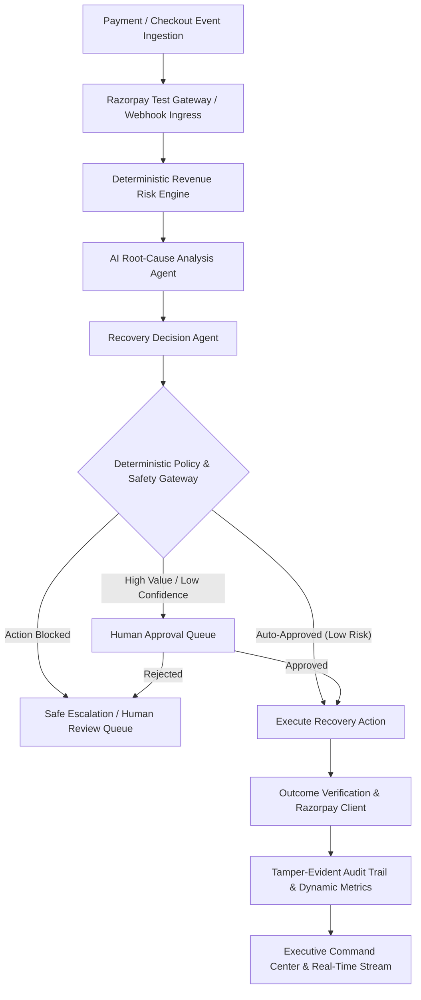

# ⚡ RevivePay AI

> **Recover Revenue Before It's Lost.**  
> Production-grade, enterprise fintech SaaS platform for autonomous revenue recovery and payment failure resolution.

---

## 🌟 Executive Overview

**RevivePay AI** is a revenue operations operating system built for modern fintechs, SaaS providers, and e-commerce merchants. Instead of treating payment declines with naive, blind retries or static chatbots, RevivePay implements an intelligent, policy-governed autonomous recovery lifecycle:

$$\textbf{DETECT} \longrightarrow \textbf{DIAGNOSE} \longrightarrow \textbf{DECIDE} \longrightarrow \textbf{ACT} \longrightarrow \textbf{VERIFY} \longrightarrow \textbf{MEASURE}$$

### 🎯 Key Design Influences
- **Stripe**: Fintech credibility, payment tables, financial KPI presentation, ledger tracking.
- **Linear**: Clean dense operational UX, issue/case tracking, keyboard-friendly navigation (`Cmd+K`), activity streams, chronological audit timelines.
- **Ramp**: Granular policy controls, rule-based permission boundaries, and Human-in-the-Loop review queues.

---

## 🏛️ System Architecture



---

## 🧠 AI vs. Deterministic Responsibilities

| Dimension | AI Responsibilities (Reasoning & Diagnosis) | Deterministic Responsibilities (Safety & Governance) |
| :--- | :--- | :--- |
| **Failures** | Root-cause interpretation & gateway log classification | Hard limits on maximum retries (e.g. max 2 retries) |
| **Decisions** | Contextual prioritization & recovery strategy recommendation | Transaction amount caps for automated execution |
| **Safety** | Personalized customer recovery copy generation | Permanent failure detection (expired card / closed account) |
| **Governance**| Structured JSON validation using Pydantic schemas | Duplicate event prevention & HMAC-SHA256 signature checks |
| **Fallback** | Pluggable LLM provider with fail-safe rule engine | Human authorization routing on low confidence |

---

## 📐 Deterministic Risk Scoring Formula

The **Revenue Risk Engine** computes a numerical risk score ($0 \text{ to } 100$) before any AI analysis:

$$\text{Risk Score} = 0.35 \times \text{Value Factor} + 0.25 \times \text{Recovery Likelihood} + 0.20 \times \text{Customer History} + 0.20 \times \text{Failure Severity}$$

- **0–29**: `LOW` (Eligible for automated execution)
- **30–59**: `MEDIUM` (Standard policy routing)
- **60–79**: `HIGH` (Human-in-the-loop review recommended)
- **80–100**: `CRITICAL` (Mandatory human operator authorization)

---

## 🎬 5-Minute Killer Demonstration Guide

To demonstrate the full end-to-end platform capabilities in under 5 minutes:

### 1. Executive Command Center (`/dashboard`)
- Review live financial KPIs: **Revenue at Risk** (₹4.82L), **Recovered Revenue** (₹2.17L), **Recovery Rate** (45.0%), and weekly recovery velocity.
- Notice the live AI Activity Ticker streaming real-time recovery milestones.

### 2. Deep-Dive Case Investigation (`/cases/RV-10291`)
- Inspect case **RV-10291** (Customer: *Vikramaditya Sharma*, Amount: ₹4,999, Category: *Temporary Bank Decline*).
- **Risk Score**: $87/100$ `HIGH` calculated via the 4-factor formula.
- **AI Diagnosis**: Diagnosed *Temporary Bank Gateway Disconnect* with $91\%$ confidence and 4 grounded factual evidence points.
- **Policy Validation**: All 7 deterministic rules checked and **PASSED**.
- Click **"Execute Recovery Action"** (or Approve) $\rightarrow$ Watch state transition to **EXECUTING** $\rightarrow$ **VERIFIED** $\rightarrow$ **RECOVERED**.
- Observe the recovered amount (+₹4,999) and updated audit log!

### 3. Safe Failure Handling & Escalation (`/simulation`)
- Open the **Simulation Lab** and click **"Retry Exhaustion & Safe Escalation"**.
- The system demonstrates safe failure: upon reaching $2/2$ maximum retries, the deterministic gateway **BLOCKS** automatic actions and routes the case to **ESCALATED** for human operator review.

---

## 🧪 Simulation Center Scenarios

1. **Temporary Bank Network Glitch** (₹4,999 • Returning customer • 504 Timeout)
2. **Permanent Invalid / Expired Card** (₹2,499 • Policy blocks retries $\rightarrow$ triggers card updater)
3. **High-Value Enterprise Transaction** (₹85,000 • Routes to Human Approval queue)
4. **Recurring Subscription Dunning** (₹14,999 • SaaS mandate failure & smart retry)
5. **High-Intent Cart Drop** (₹6,999 • 91% intent score $\rightarrow$ personalized cart reminder)
6. **Retry Exhaustion Escalation** (₹6,200 • Max retries exhausted $\rightarrow$ safe escalation)

---

## 🚀 Quickstart & Local Installation

### Prerequisites
- Python 3.10+
- Node.js 18+

### 1. Backend Setup
```bash
# Navigate to project root
cd /Users/harsh/Desktop/Razorpay

# Install backend dependencies
python3 -m pip install -r backend/requirements.txt

# Seed realistic database (500+ payments, 100+ customers, 50+ cases)
python3 -m backend.seed_data

# Run backend tests
PYTHONPATH=. pytest backend/tests -v

# Start FastAPI server
uvicorn backend.main:app --host 0.0.0.0 --port 8000 --reload
```

### 2. Frontend Setup
```bash
# Install dependencies
npm install

# Build for production
npm run build

# Start Vite development server
npm run dev
```

The application will be accessible at:
- **Frontend Dashboard**: `http://localhost:5173`
- **Backend API & Swagger Docs**: `http://localhost:8000/docs`

---

## 📦 Docker Deployment

```bash
docker-compose up --build
```
- Frontend: `http://localhost:80`
- Backend API: `http://localhost:8000`

---

## 🛡️ Security & Idempotency
- **HMAC-SHA256 Webhook Verification**: `X-Razorpay-Signature` validation prevents spoofed payloads.
- **Idempotency Tracking**: Ingested events are recorded in `webhook_events` to prevent duplicate recovery runs.
- **Role-Based Access Control (RBAC)**: JWT authentication with personas:
  - `MERCHANT_OWNER`
  - `REVENUE_OPERATOR`
  - `SUPPORT_OPERATOR`
  - `ADMIN`
