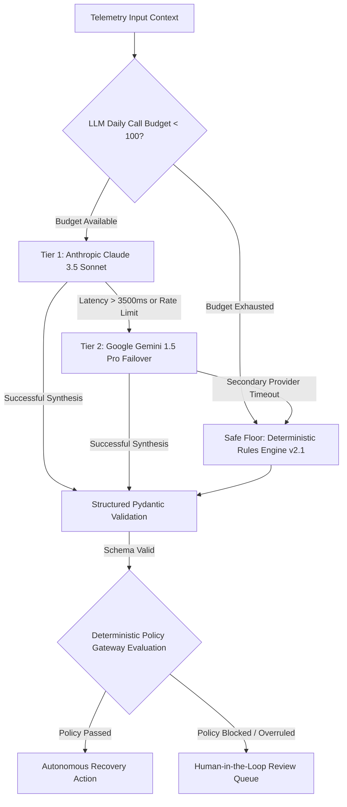

# RevivePay AI — AI Decision Architecture & Fallback Mechanics

## 1. Multi-Tier Decision Hierarchy



## 2. Structured Output Schema & Bounded Tool Actions
The model returns strictly validated JSON conforming to `RootCauseAnalysisOutput`:
```json
{
  "root_cause": "temporary_bank_switch_latency",
  "confidence": 0.94,
  "evidence": [
    "Issuer HDFC switch timeout (504)",
    "Customer reliability score 98%",
    "Low transaction velocity"
  ],
  "recommended_action": "retry_payment",
  "reasoning_summary": "Transient gateway switch latency. Idempotency token verified; low-latency direct route retry recommended."
}
```

## 3. Policy Override Demonstration
When the AI proposes an action with high confidence (e.g. 94%), but the transaction amount exceeds the automated action threshold (₹10,000), the **Deterministic Policy Gateway** overrules the model and routes the case to human operators, recording `recovery.policy.overrode_ai_recommendation` in the audit ledger.
