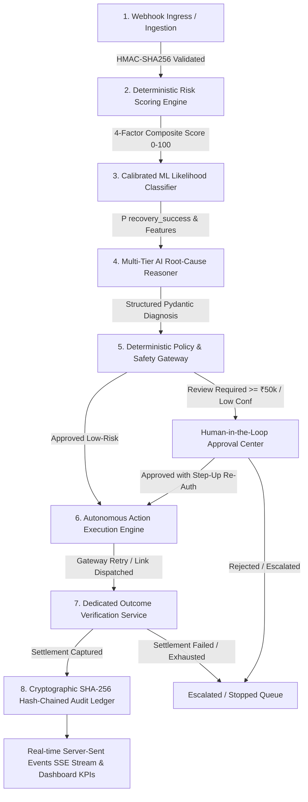

# RevivePay AI — System Architecture Specification

## 1. Executive Summary
RevivePay AI is a production-oriented, policy-governed autonomous revenue recovery platform. The system operates as an intelligent decision layer between payment gateways, merchant policies, and customers to recover failed payments, prevent subscription churn, and recover abandoned checkouts.

## 2. Core 8-Stage Autonomous Recovery Pipeline

## 3. High-Level System Components

### 3.1 Ingestion & Gateway Layer
- **Razorpay Test Mode Ingestion**: Webhooks received over HTTPS, validated with constant-time HMAC-SHA256 signature checking.
- **Idempotency & Deduplication**: Filtered through `UNIQUE(provider, provider_event_id)` preventing duplicate processing.
- **Dual Ingestion**: Real webhook ingress (`source: RAZORPAY_TEST`) + synthetic simulation engine (`source: SIMULATION`).

### 3.2 Machine Learning & Analytical Layer
- **Calibrated Classifier**: `CalibratedClassifierCV(GradientBoostingClassifier, cv=5, method='isotonic')`.
- **Inference Service**: Predicts $P(\text{recovery\_success})$ across 10 transaction signals.
- **Diagnostic Metrics**: ROC-AUC: `0.7942`, F1: `0.8702`, Brier Score: `0.1428`.

### 3.3 Artificial Intelligence Decision Layer
- **Multi-Tier Orchestrator**:
  - Primary: Anthropic Claude 3.5 Sonnet (`claude-3-5-sonnet-20241022`)
  - Secondary Failover: Google Gemini 1.5 Pro (`gemini-1.5-pro`)
  - Safe Floor: Deterministic Rules Engine (`rule-engine-v2.1`)
- **Cost Guardrails**: 100-call daily quota before automatic rules floor engagement.

### 3.4 Deterministic Policy Gateway
- Sits strictly between LLM proposals and execution.
- 10+ deterministic invariants (retry caps, permanent decline blocking, customer opt-out respect, step-up MFA on high-value $\ge ₹50,000$).

### 3.5 Execution & Outcome Verification
- Never marks cases `RECOVERED` without cryptographically verifying provider capture references and settled currency amounts.

### 3.6 Cryptographic Audit Ledger
- SHA-256 hash-chaining linking every event to its predecessor:
  $$\text{hash}_n = \text{SHA-256}(\text{hash}_{n-1} + \text{audit\_id} + \text{actor} + \text{action} + \text{notes})$$
