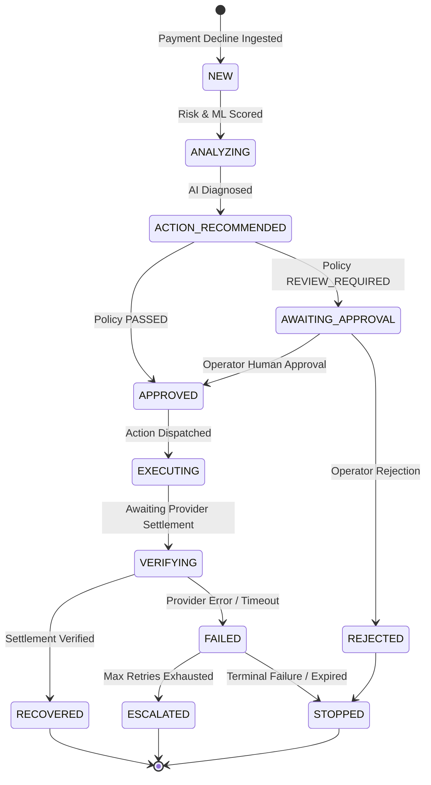

# RevivePay AI — Recovery State Machine & Execution Flow

## 1. Explicit 12-State Lifecycle

## 2. Invariant Rules Across Transitions

1. **Retry Limit Invariant**: `retry_count <= max_retry_count` (Default: 2 retries). Once reached, automated actions are strictly blocked and state moves to `ESCALATED`.
2. **Settled Payment Immutability**: If `payment.status == "SUCCESS"`, all further retry actions are permanently blocked.
3. **Outcome Verification Gate**: No case may transition to `RECOVERED` without `outcome_verified == True` and matching settled amount.
4. **Step-Up Authentication Gate**: Any action on cases with `amount >= ₹50,000` requires operator re-authentication via password/OTP before transitioning to `APPROVED`.
5. **TAT Breach Auto-Escalation**: Cases exceeding statutory Turn Around Time deadlines ($T+1$ UPI / $T+5$ Card) accrue ₹100/day customer compensation and automatically escalate to senior operators.
