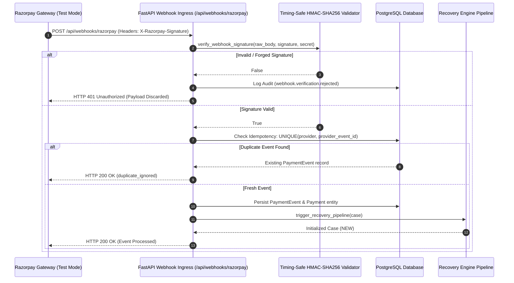

# RevivePay AI — Razorpay Webhook Ingress & Verification Flow

## 1. Webhook Processing Architecture

## 2. Key Security Properties
- **Timing-Safe Equality**: Uses `hmac.compare_digest()` to prevent timing attack vulnerabilities.
- **Idempotency Guarantee**: `provider_event_id` deduplication guarantees exactly one case created per webhook event.
- **Defense Audit Trail**: All rejected signatures emit immutable audit events (`webhook.verification.rejected`) logging perimeter defense in real-time.
